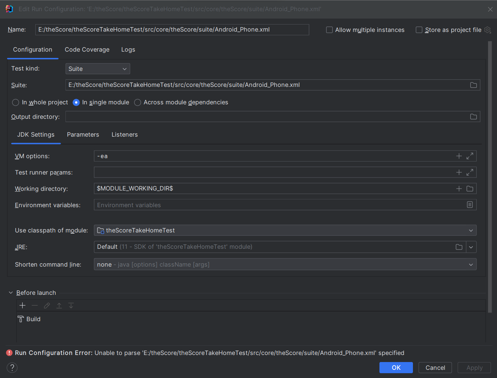

# **TheScoreTakeHomeTest**

**QA Automation Engineer** - Take Home Test from Score Media and Gaming Inc.

### **Solution Stack:**

- Appium (v2)
- Intellij (v2023.3.4)
- Java (v11)

### **Pre-requisites:**

- theScore App Build Version: 24.2.0.

- Android Studio Emulator Device: Google Pixel 7, Android 12.

### **Test Specification**

**TheScoreTakeHomeTest Test Specification**

#### Objective:
The objective of this Automation test is to perform certain testing activities on the TheScore android application.

#### Scope: 
The scope of this testing effort is to perform certain automated testing tasks on the TheScore application to verify specified steps.

#### Test Objectives: 

The testing objectives are as follows:
1. Open a league, team, or player page of your choice (bonus points for using a data-driven or parameterized approach).
2. Verify that the expected page opens correctly.
3. Tap on a sub-tab of your choice, eg: league table/standings/leaders, or stats tab of the league, team, or player. 
4. Verify that you are on the correct tab and that the data is displayed correctly and corresponds to the league, team, or player from step 1. 
5. Verify that back navigation returns you to the previous page correctly.

#### Requirements:

Writing automation tests that finds a league, team, or player within theScore app and verify the specified steps and assuming the project will be the foundation for an automation suite.

#### Design: 

- Design: The automation test suite consists of one automation test script which is provided with parameterized data and executed for two test scenarios.
- Test Scenario: Using theScore app, input data in the search bar to search for soccer teams and ensure the correct page and correct tabs are loaded properly. 
- Test case name: Test search for Man Utd, Test search for TFC. 

#### Test Procedures:

#### Test Setup

1. Please keep the apk file under `src/core/theScore/app` in the project - theScoreTakeHomeTest.
2. After step 1, please provide the absolute path of the apk file to the property `mobile.app.android` inside `src/core/Properties/ConfigurationData.properties`.
3. All Maven dependencies are included in the `pom.xml` file.
4. Start the Android Emulator/Device.
5. To run Appium on your local system, install Node.js if it doesn't exist already from _https://nodejs.org/en/download/_.
6. After installation is complete, restart the terminal and run the command -> node –version. Mac users can use the node -v and npm -v commands to verify the installation and version details.
7. To install Appium, run the following command -> `npm install -g appium`.
8. For the purposes of this test, please install the Android driver for Appium by running this command -> `appium driver install uiautomator2`.
9. Run the Appium server in a Command Prompt/PowerShell window using the following command:`appium -a 127.0.0.1 -cp 4723 -pa /wd/hub`.
10. The test is now ready to execute and the test can be run by executing a xml file.
11. Run the `Android_Phone.xml` file under `src/core/theScore/suite/Android_Phone.xml`. Please ensure to set correct properties as below:

#### Test Deliverables:

- GitHub repository link - https://github.com/sjain220792/theScoreTakeHomeTest.git.
- theScore android app build version 24.2.0.
- Automation Test Report - output/AutomationReportsreport.html.

### Testing Rationale

- This automation testing framework attempts to leverage the power of automated testing using Maven dependencies, Page Object Model and TestNG framework.
- The framework is divided into different packages to ensure accurate compartmentalization which makes the framework easier to understand.
- With the help of parameterized testing approach the tests can be executed multiple times. 
